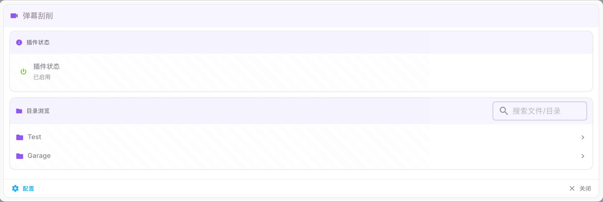

# 弹幕刮削(影视版)

此插件根据文件匹配弹弹平台上的弹幕,将弹幕文件转换为ass格式字幕,用于实现在不支持弹幕播放的设备上模拟弹幕.

### 手动匹配与搜索
- 前端支持搜索弹弹番剧并手动匹配，可选“目录”或“单文件”范围；单文件仅作用于该文件。
- 手动匹配数据保存在目录下 `.dandan.anime.json`（旧 `.id` 会自动转换并删除）；单文件匹配存储在插件缓存。
- 手动匹配支持“集数偏移”：本地集数 + 偏移 = 弹弹集数。用于 TMDB 连续计数而弹弹按季重置的番剧，如本地 S02E13 对应弹弹第二季第 1 集则填 `-12`。
- 生成的弹幕文件为 UTF-8 无 BOM `.danmu.ass`，合并中文字幕时为原字幕事件补充 `{\blur10}` 提升可读性。

### 文件匹配规则
首先会尝试使用文件hash直接匹配文件,如果没有匹配到怎会尝试使用TMDB ID来进行匹配.

### 更新日志

-  v1.1: 修复设置页面闪退问题
-  v1.0: 基于弹幕刮削插件重构，适配通用影视电视剧弹幕刮削，支持自定义弹幕API后端地址

### 致谢

- [HankunYu](https://github.com/HankunYu/MoviePilot-Plugins) - 原弹幕刮削插件作者
- [danmu-api](https://github.com/huangxd-/danmu_api) - 弹幕数据服务后端

### License

[MIT](LICENSE)
